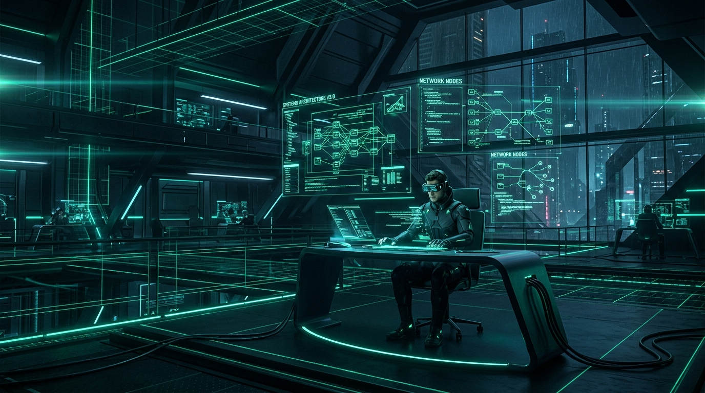

  

  

  
  
  
  

---

### 🚀 About Me & Engineering Philosophy

I am a **Principal Systems Architect & Master Full-Stack Engineer** dedicated to building high-performance, client-side, **Local-First** applications. I believe that modern browsers are powerful computing runtime engines capable of handling enterprise workloads without unnecessary server overhead, latency, or paid proprietary SaaS dependencies.

- 🔭 **Current Focus:** Complex client-side operating systems (SimuCorp OS, OmniPOS, MediPulse ERP), real-time WebRTC tools (PresensiOS), and high-frequency game economy simulators.
- ⚡ **Engineering Principles:** Zero-latency state machines, client data sovereignty via IndexedDB/LocalStorage, strict TypeScript typing, and anti-AI-slop utilitarian UI design.
- 📫 **Connect with Me:** [olyxmintabansos@gmail.com](mailto:olyxmintabansos@gmail.com) • [GitHub Issues / Discussions](https://github.com/olyxmintabansos-byte)

---

### 🛠️ Tech Stack & Systems Tooling

  <!-- Languages -->
  
  
  
  
  
   
  <!-- Frameworks & UI Engines -->
  
  
  
  
  
   
  <!-- Browser Runtime APIs & Storage -->
  
  
  
  

---

### 🌟 Flagship Applications & Live Demos

| Project | Category | Architectural Highlight | Live Demo | Repository |
|---|---|---|:---:|:---:|
| 🐾 **VetHospital OS** | Veterinary EHR | Multi-species emergency triage, surgical anesthesia vaporizer SCADA, & ICU fluid therapy (#22 Claymorphism). | [Live Demo](https://olyxmintabansos-byte.github.io/vethospital-os/) | [Repo](https://github.com/olyxmintabansos-byte/vethospital-os) |
| 💊 **PharmaTrace GMP** | Pharma MES | Cleanroom HVAC cascade, 21 CFR Part 11 eBR electronic signatures, & ICH Q1A stability (#9 Material Elevation). | [Live Demo](https://olyxmintabansos-byte.github.io/pharmatrace-gmp/) | [Repo](https://github.com/olyxmintabansos-byte/pharmatrace-gmp) |
| 🔬 **BioLab LIMS** | Biotech LIMS | Specimen accessioning, RT-PCR thermocycling, cryo reagent inventory, & ISO 15189 COA A4 (#8 Flat Sterile Grid). | [Live Demo](https://olyxmintabansos-byte.github.io/biolab-lims/) | [Repo](https://github.com/olyxmintabansos-byte/biolab-lims) |
| 🌊 **AquaMarine Farm** | Aquaculture RAS | IoT dissolved oxygen telemetry, MBBR protein skimmer filtration, & ASC/BAP aquaculture passport (#23 Aurora Mesh). | [Live Demo](https://olyxmintabansos-byte.github.io/aquamarine-farm/) | [Repo](https://github.com/olyxmintabansos-byte/aquamarine-farm) |
| 🌾 **AgroHarvest OS** | Smart Agriculture | IoT soil moisture/NPK sensing, autonomous drip fertigation, & IndoGAP/GlobalG.A.P. harvest certificate (#24 Organic Pastel). | [Live Demo](https://olyxmintabansos-byte.github.io/agroharvest-os/) | [Repo](https://github.com/olyxmintabansos-byte/agroharvest-os) |
| 🌌 **Titan Portfolio** | AI & Systems Hub | Executive interactive systems portfolio with Multi-Agent AI Copilot & Systems Observatory. | [Live Demo](https://olyxmintabansos-byte.github.io/olyx-portfolio/) | [Repo](https://github.com/olyxmintabansos-byte/olyx-portfolio) |
| 🧠 **NeuroForge AI** | Multi-Agent AI | Autonomous multi-agent consensus studio & adversarial debate engine with live token telemetry. | [Live Demo](https://olyxmintabansos-byte.github.io/neuroforge-ai/) | [Repo](https://github.com/olyxmintabansos-byte/neuroforge-ai) |
| ⚡ **Nexus ShiftOps** | Workforce ERP | 24/7 weekly Gantt shift roster, automated PPh 21/BPJS payroll, A4 payslip, & fleet fuel telemetry. | [Live Demo](https://olyxmintabansos-byte.github.io/nexus-shiftops/) | [Repo](https://github.com/olyxmintabansos-byte/nexus-shiftops) |
| 🎓 **EduCore Titan** | Academic ERP | School OS, anti-cheat CBT exam simulator, digital gradebook with A4 report card & SPP cashier. | [Live Demo](https://olyxmintabansos-byte.github.io/educore-os/) | [Repo](https://github.com/olyxmintabansos-byte/educore-os) |
| 🏢 **SimuCorp OS** | Business Sim | Cyberpunk megacorporation financial simulation, stock exchange & corporate raiding. | [Live Demo](https://olyxmintabansos-byte.github.io/simucorp-os/) | [Repo](https://github.com/olyxmintabansos-byte/simucorp-os) |
| 🛍️ **ForgeCommerce** | E-Commerce | Headless storefront & marketplace engine with Quick-Cart drawer & flash sale timer. | [Live Demo](https://olyxmintabansos-byte.github.io/forgecommerce-engine/) | [Repo](https://github.com/olyxmintabansos-byte/forgecommerce-engine) |
| ☕ **OmniPOS OS** | F&B / Retail | Touch POS cashier terminal, kitchen display (KDS), and ingredient inventory. | [Live Demo](https://olyxmintabansos-byte.github.io/omnipos-os/) | [Repo](https://github.com/olyxmintabansos-byte/omnipos-os) |
| 🏥 **MediPulse ERP** | Healthcare | Integrated clinic & pharmacy ERP with ICD-10 electronic records & FEFO inventory. | [Live Demo](https://olyxmintabansos-byte.github.io/medipulse-erp/) | [Repo](https://github.com/olyxmintabansos-byte/medipulse-erp) |
| 📊 **DataPulse AI** | Analytics | Predictive e-commerce analytics platform for stockout forecasts & churn scoring. | [Live Demo](https://olyxmintabansos-byte.github.io/datapulse-ai/) | [Repo](https://github.com/olyxmintabansos-byte/datapulse-ai) |
| 📄 **CraftCV AI** | Career AI | ATS resume builder & interactive job interview simulator with STAR method. | [Live Demo](https://olyxmintabansos-byte.github.io/craftcv-ai/) | [Repo](https://github.com/olyxmintabansos-byte/craftcv-ai) |
| 💳 **FinPulse AI** | Finance | Corporate financial intelligence, cash runway monitor, and Virtual AI CFO. | [Live Demo](https://olyxmintabansos-byte.github.io/finpulse-ai/) | [Repo](https://github.com/olyxmintabansos-byte/finpulse-ai) |
| 💼 **FinOS UMKM** | Small Business | Indonesian SME bookkeeping, cashflow management, and PPh Final 0.5% calculator. | [Live Demo](https://olyxmintabansos-byte.github.io/buku-kas-umkm/) | [Repo](https://github.com/olyxmintabansos-byte/buku-kas-umkm) |
| 💠 **PresensiOS** | Enterprise | Client-side attendance system with WebRTC face scan & Haversine geofencing radar. | [Live Demo](https://olyxmintabansos-byte.github.io/presensios/) | [Repo](https://github.com/olyxmintabansos-byte/presensios) |
| 🚀 **Project Hub** | Portal | Central developer portal & interactive launcher connecting all Olyx applications. | [Live Demo](https://olyxmintabansos-byte.github.io/olyx-project-hub/) | [Repo](https://github.com/olyxmintabansos-byte/olyx-project-hub) |
| 🔐 **Lock Manager** | Utility | React 19 + TypeScript + Dexie accounting suite for Growtopia wealth tracking. | [Live Demo](https://olyxmintabansos-byte.github.io/growtopia-lock-manager/) | [Repo](https://github.com/olyxmintabansos-byte/growtopia-lock-manager) |
| 🎵 **StreamShift** | Media | Ad-free local YouTube to MP3 & MP4 converter powered by FastAPI & standalone FFmpeg. | [Live Demo](https://olyxmintabansos-byte.github.io/yt-converter/) | [Repo](https://github.com/olyxmintabansos-byte/yt-converter) |
| 🚀 **Startopia Simulator** | Gaming | Retro pixel-art Growtopia voyage mission trainer with 8-bit sound effects. | [Live Demo](https://olyxmintabansos-byte.github.io/startopia-simulator/) | [Repo](https://github.com/olyxmintabansos-byte/startopia-simulator) |
| ⛏️ **Farm Calc Pro** | Gaming | Multi-item Growtopia farming calculator with tree harvest multipliers & loops. | [Live Demo](https://olyxmintabansos-byte.github.io/Growtopia-Calculator-ib-Erwinher/) | [Repo](https://github.com/olyxmintabansos-byte/Growtopia-Calculator-ib-Erwinher) |
| 🏥 **Autoclave Pro** | Gaming | Surgery tool sterilizer calculator simulating compounding tool cycles and ROI. | [Live Demo](https://olyxmintabansos-byte.github.io/Autoclave/) | [Repo](https://github.com/olyxmintabansos-byte/Autoclave) |
| ⚡ **Nanoforge Pro** | Gaming | Startopia tool recycle simulator calculating Tactical Drone & Teleporter margins. | [Live Demo](https://olyxmintabansos-byte.github.io/Nanoforge-/) | [Repo](https://github.com/olyxmintabansos-byte/Nanoforge-) |
| ⏱️ **GrowTimer Pro** | Gaming | Multi-timer suite with auto-save localStorage persistence and Web Audio chimes. | [Live Demo](https://olyxmintabansos-byte.github.io/timer-gt/) | [Repo](https://github.com/olyxmintabansos-byte/timer-gt) |

---

### 📊 GitHub Activity & Statistics

  
  

  

---

  <i>⭐ Feel free to explore my repositories, open issues, or submit pull requests!</i>

  
  

  <strong>© 2026 by Olyx (@olyxmintabansos-byte)</strong> • All rights reserved.

